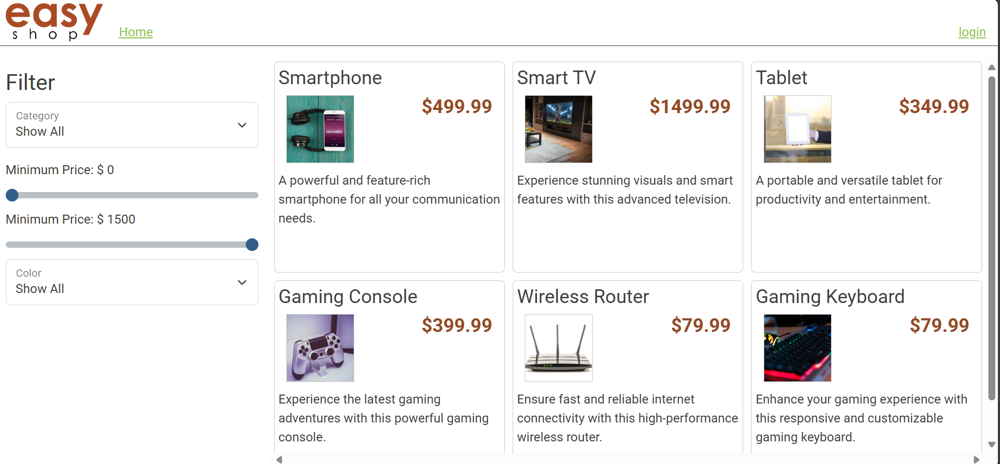
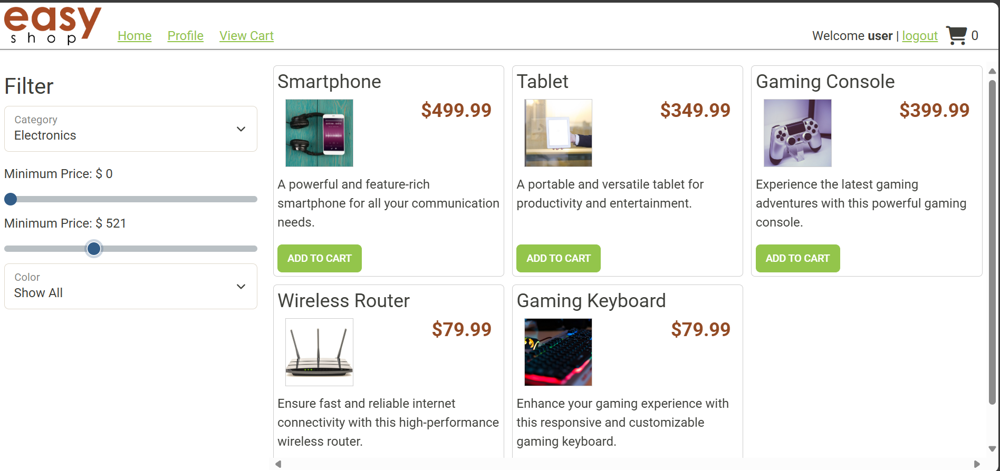
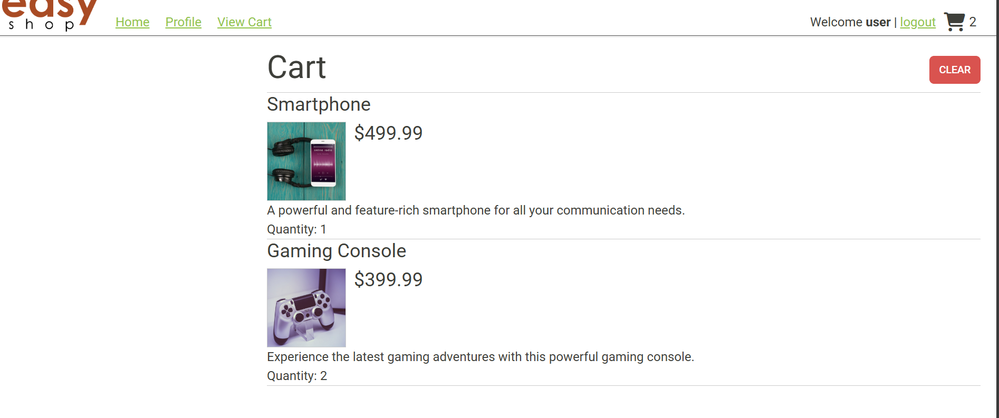
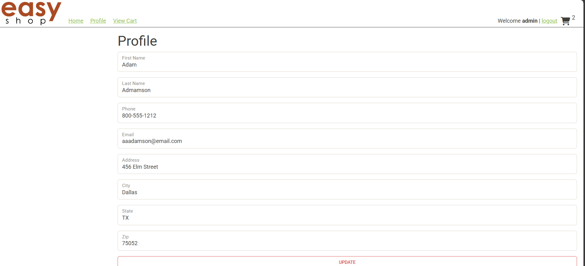

# EasyShop_eccomerce_api

## Overview

This is the backend API for **EasyShop**, a demo e-commerce platform developed using **Spring Boot** and **MySQL**. The API supports user authentication, category and product management, and a complete shopping cart system. This version is building on a previously existing site.

---
##  Phase 1: CategoriesController Implementation

In this phase, we focused on building out the full **CRUD functionality for product categories**.

### Implemented Methods in `CategoriesController`:
- `GET /categories` – Get all categories
- `GET /categories/{id}` – Get category by ID
- `POST /categories` – Create a new category (**ADMIN only**)
- `PUT /categories/{id}` – Update an existing category (**ADMIN only**)
- `DELETE /categories/{id}` – Delete a category (**ADMIN only**)

- Used `@PreAuthorize("hasRole('ADMIN')")` annotations to secure admin-only routes.
- Developed corresponding SQL operations in `MySqlCategoriesDao`.

---

## Phase 2: Bug Fixes in `ProductsController`

In this phase, we focused on resolving two major bugs related to **product search** and **product updates**.

###  Bug 1: Incorrect Search Results
- Search functionality using filters like `categories`, `minPrice`, `maxPrice`, and `color` was returning incorrect or incomplete results.
- Investigated and corrected logic in `MySqlProductsDao` to properly apply all filter parameters using SQL `WHERE` clauses.

### Bug 2: Duplicate Product Entries on Update
- Updating a product resulted in duplicate rows instead of modifying the existing one.
- The issue was caused by using an `INSERT` operation in update logic.
- Fixed the implementation in `MySqlProductsDao.update()` to properly use `UPDATE` SQL instead of `INSERT`.

## Features

###  Authentication
- Register and Login with roles (`USER`, `ADMIN`)
- JWT Token-based session handling

### Product Catalog
- List and search products
- Filter by category, price range, and color
- Admin-only CRUD operations for products

### Categories
- View all categories
- Admin-only CRUD operations for categories

###  Shopping Cart (Implemented)
- Logged-in users can:
  - Add products to cart
  - Add muliple quantity of a single product by clicking add to cart more than once
  - Clear the cart
  - View the current cart contents

### User Profiles (Implemented)
- View and update the logged in user profile information

## Future Steps 

1. Create order
2. Checkout functionality 
3. Get cart after checkout
4. Update product quanity straight from the cart page
5. Possibly allowing users to create an account

---

## Technologies Used

- Java 17
- Spring Boot 3
- Spring Security (JWT)
- MySQL
- JPA / JDBC
- Postman (API testing)
- Frontend: HTML/CSS/JS (for demo)

---

## How to Run

1. **Clone this repository**  

2. **Set up the database**  
- Open `create_database.sql` in MySQL Workbench.
- Run the script to set up schema and sample data.

3. **Run the application**  
Use IntelliJ or terminal:

4. **Open Postman**
Create a workspace and uplad the two files easyshop_solo and easyshop_solo_optional files and run.
Must run easyshop_solo before running the optional postman tests

5. **Run the frontend site by cloning the other repositary called EasyShop_eccomerce_frontend-website and navigate to index.html and open in your chosen browser**

## User for Testing 
Use the following usernames admin, user, george with password: password

## Challanges encountered
In this project I encountered was the POST register test failing initially because I didnt run the create database each time before running postman tests.
Also I had a similar challange when running the optional postman tests and they initailly where failing, until I realized I had to run the required postman tests before running the optional. 
In addition, throughout the project I went back and forth between postman, intelj, mySQL, and the front end to test my code. 

## Interesting Peice of code
One piece of code I found interesting was how the cart is saved even after logging out and logging back in. This functionality is handled in the MySqlShoppingCartDao class through the getByUserId method. 
Instead of storing the cart in memory, the application saves it to a shopping_cart table in the MySQL database. This allows the cart data to persist across sessions. When the user logs in again and navigates to the cart,
the system retrieves their saved cart using their userId. I found this interesting because it shows how backend persistence can be used to create a seamless and consistent user experience, even when users log in from different sessions or devices.
```java
@Override
public ShoppingCart getByUserId(int userId) {
    ShoppingCart shoppingCart = new ShoppingCart();

    String sql = """
        SELECT p.*, sc.* FROM shopping_cart sc
        JOIN products p ON sc.product_id = p.product_id
        WHERE sc.user_id = ?
        """;

    try (Connection connection = getConnection();
         PreparedStatement preparedStatement = connection.prepareStatement(sql)) {

        preparedStatement.setInt(1, userId);

        try (ResultSet results = preparedStatement.executeQuery()) {
            while (results.next()) {
                Product product = mapRow(results);
                ShoppingCartItem shoppingCartItem = new ShoppingCartItem();
                shoppingCartItem.setProduct(product);
                shoppingCartItem.setQuantity(results.getInt("quantity"));
                shoppingCart.add(shoppingCartItem);
            }
        }
    } catch (Exception e) {
        throw new RuntimeException(e);
    }

    return shoppingCart;
}

```
## Screenshot of Postman tests
[EasyShop_solo_postman_results](Screenshots/easyShop_api_postman%20_results.png)

[EasyShop_solo_optional_postman_results](Screenshots/easyshop_optional_api_postman_results.png)









